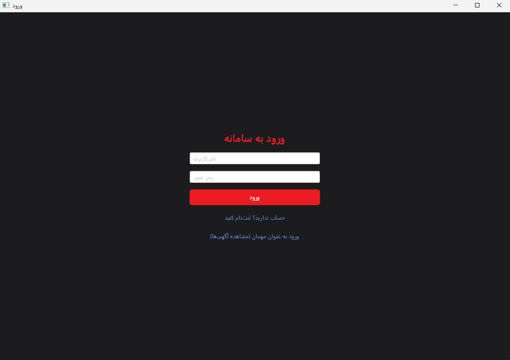
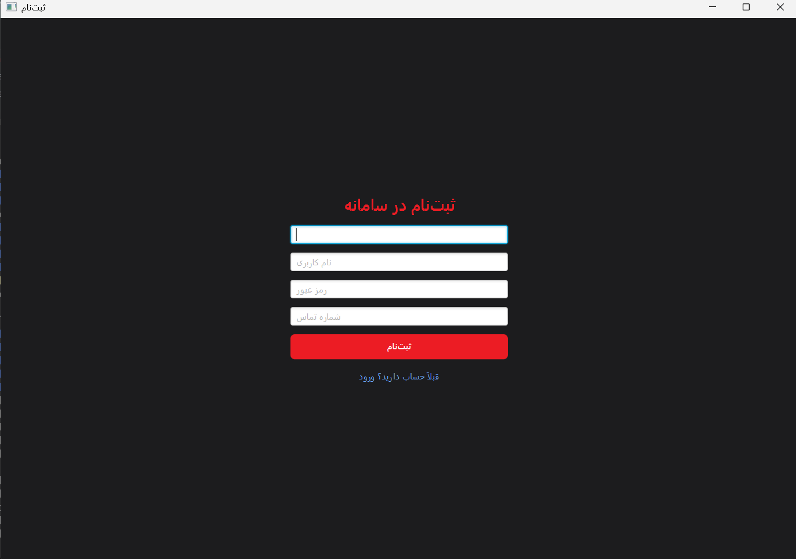
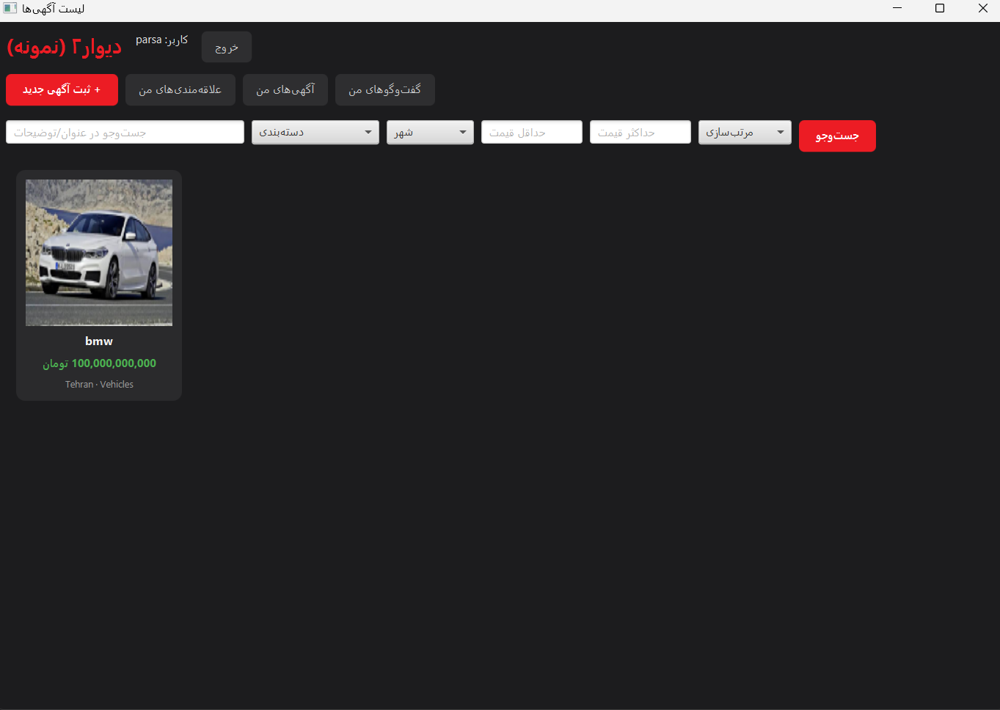
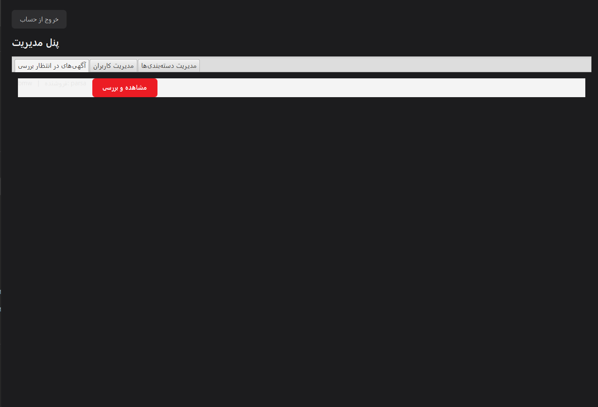
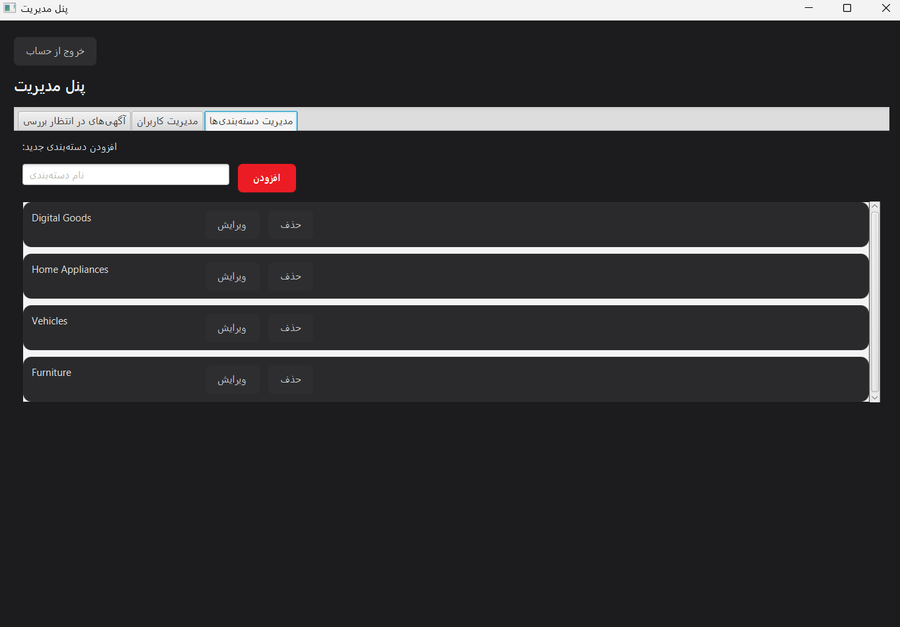
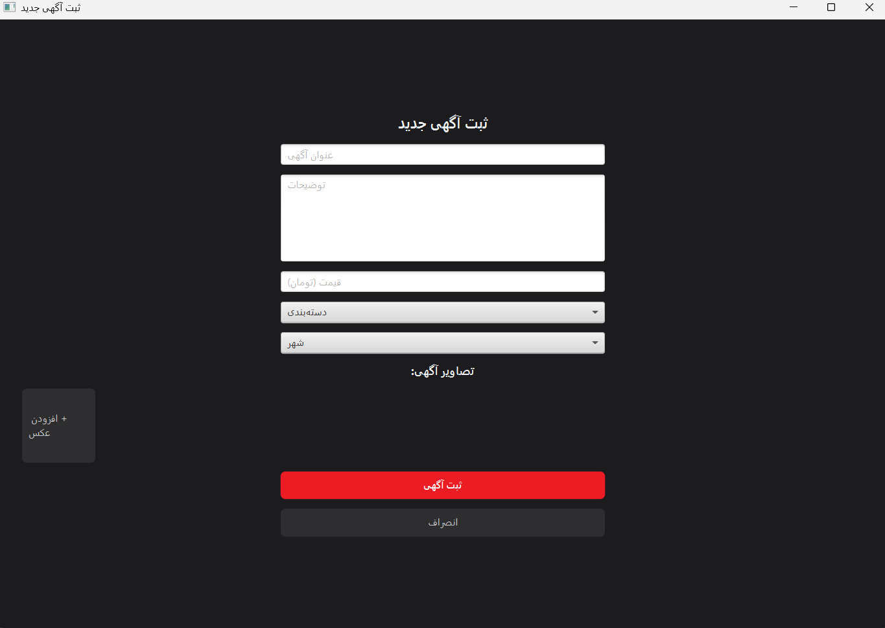
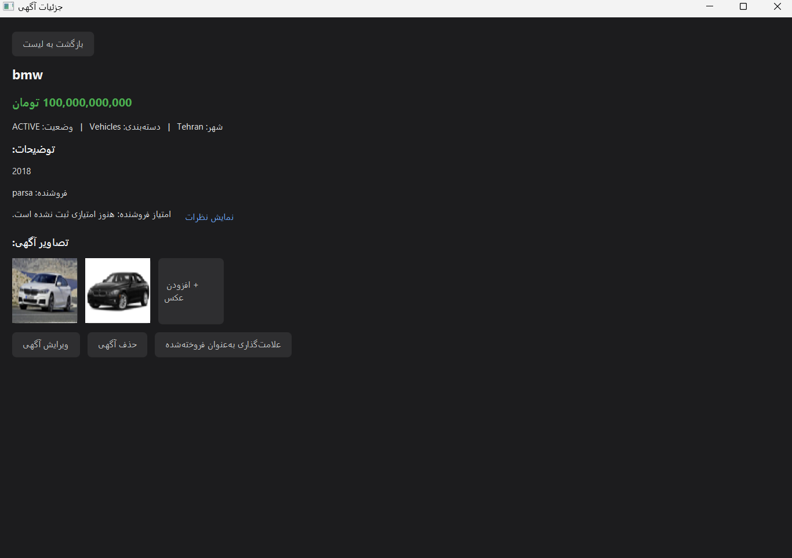

# Second-hand Marketplace — Advanced Programming Project

A web-based marketplace application where users can register, post advertisements for second-hand items, search and filter listings, chat with sellers, save favorites, and rate sellers after a transaction. An admin panel allows reviewing and moderating advertisements and managing users.

## Team Members
- Parsa Vakili
- Mahdi Nikzad

---

## Technologies Used

**Backend**
- Java 17+
- Spring Boot 4.1.0 (Spring Web, Spring Data JPA, Spring Security)
- JWT (io.jsonwebtoken / jjwt) for authentication
- SQLite (via Hibernate Community Dialect)
- Maven

**Frontend**
- JavaFX 21
- Jackson (JSON serialization/deserialization)
- Java 11 HttpClient (for calling the backend REST API)

---

## Prerequisites

- JDK 17 or higher
- Maven
- Git
- (Optional) Postman, for testing API endpoints manually
- (Optional) DB Browser for SQLite, for inspecting the database file

Check your installation:
```
java -version
mvn -version
```

---

## Project Structure

```
secondhand-java-project/
├── backend/     # Spring Boot backend (Java)
├── frontend/    # JavaFX frontend
├── docs/        # API contract and other documentation
└── README.md
```

---

## Running the Backend

1. Navigate to the backend folder:
   ```
   cd backend
   ```
2. Run the application:
   ```
   mvn spring-boot:run
   ```
3. The server starts on port `8080`. Verify it's running:
   ```
   GET http://localhost:8080/api/health
   ```
   Expected response: `Backend is running`

No manual database setup is required — SQLite creates the database file (`secondhand.db`) automatically on first run, and sample categories/cities are inserted automatically.

---

## Running the Frontend

Make sure the backend is running first, since the frontend depends on it (`http://localhost:8080`).

1. Navigate to the frontend folder:
   ```
   cd frontend
   ```
2. Run the application:
   ```
   mvn javafx:run
   ```
3. A JavaFX window opens starting on the login screen. Register a new account or use one of the [test accounts](#test-accounts) below.

The backend base URL is configured in `ApiConfig.java` (defaults to `http://localhost:8080`) — update it there if the backend runs on a different host or port.

---

## Data Storage

This project uses **SQLite** as the persistent storage method. No external database server is required — the database is stored in a single file (`secondhand.db`) inside the `backend` folder, created automatically the first time the backend runs.

- Database file: `backend/secondhand.db`
- Sample data (categories and cities) is seeded automatically via `data.sql` on every startup (using `INSERT OR IGNORE`, so it's safe to restart without duplication errors).
- The database file is excluded from version control (`.gitignore`) — each team member has their own local copy with their own test data.

---

## Test Accounts

The database starts empty. To test the application, register regular
user accounts (or any accounts you prefer) via `POST /api/auth/register`
(or through the registration screen in the JavaFX app).

A default admin account is created automatically on first run:

| Role | Username | Password |
|---|---|---|
| Admin (built-in) | `admin` | `Admin@123` |

> **Note:** The admin account is seeded automatically when the backend
> starts (see `AdminSeeder`), so no manual database editing is needed.
> New users registered through the app are always given the `USER` role
> by default. To promote a regular user to `ADMIN`, stop the backend and
> manually change the `role` column for that user in the `users` table
> (e.g. using DB Browser for SQLite).

---

## Implemented Features

### Backend (complete)
- User registration and login with JWT-based authentication
- Password hashing (BCrypt)
- Role-based access control (`USER` / `ADMIN`)
- Advertisement creation, listing (with keyword search, category/city/price filters, and sorting), detail view, editing, deletion, and marking as sold
- Ownership checks: only the advertisement owner can edit, delete, or mark it as sold
- Categories and cities listing
- Favorites: add, list, remove, with duplicate prevention
- Chat: starting a conversation, listing conversations, sending and viewing messages
- Prevents users from messaging themselves about their own advertisement
- Ratings: submitting a 1–5 score with optional comment, average score calculation, duplicate-rating prevention, self-rating prevention
- Admin panel: listing pending advertisements, approving/rejecting them, listing users, blocking/unblocking users
- Image upload for advertisements (multipart upload, stored on disk, served as static resources, ownership-restricted)
- Standardized error responses (`{ "message": ..., "status": ... }`) across all endpoints
- Full API documentation available in [`docs/api-contract-en.md`](docs/api-contract-en.md)

### Frontend (complete)
- Login and registration screens, with the session (JWT) kept in memory for subsequent requests
- Advertisement listing with keyword search, category/city/price filters, and sorting
- Advertisement detail view, including seller info and rating summary
- Posting, editing, and marking-as-sold for the current user's own advertisements (`My Ads`)
- Image picker for attaching photos to an advertisement
- Favorites: add/remove and view saved advertisements
- Chat: list of conversations and a message thread view for messaging sellers/buyers
- Ratings: submitting a score/comment for a seller and viewing rating comments
- Admin panel: reviewing pending advertisements (approve/reject) and managing users (list/block/unblock)

---

## Screenshots

### Login


### Register


### Home


### Admin Panel


### Category Managment


### Create Advertisement


### Advertisement Details

---

## Individual Contributions

**Parsa Vakili:**
I was responsible for designing and implementing the entire Backend of the project. This included setting up the initial Spring Boot project structure with SQLite as the persistence layer, and designing the domain model (User, Advertisement, AdImage, Category, City, Conversation, Message, Favorite, and Rating entities) along with their relationships. I implemented the layered architecture (repository, service, controller, DTO, and exception-handling layers) and built authentication and authorization from scratch, including JWT token generation/validation and Spring Security configuration to protect routes based on ownership and user roles. I implemented all core API endpoints — advertisement CRUD with keyword search, filtering, and sorting; favorites; the chat system (conversations and messages); the rating system with validation rules; the admin panel for reviewing advertisements and managing users; and image upload for advertisements. I manually tested every endpoint (success and error paths) using Postman throughout development, and wrote the API contract (`docs/api-contract-en.md`) that documents all endpoints for frontend integration, along with this README.

**Mahdi Nikzad:**
I was responsible for the JavaFX frontend: the API client layer (`ApiClient`/`MultipartApiClient`) for calling the backend REST endpoints, the session/state management (`SessionManager`), and the UI screens covering login/registration, advertisement listing with search and filters, advertisement details, posting/editing/marking-as-sold for the user's own ads, image upload, favorites, chat conversations and messaging, seller ratings, and the admin panel.

---

## Additional Documentation

- [`docs/api-contract-en.md`](docs/api-contract-en.md) — full list of API endpoints with request/response examples
